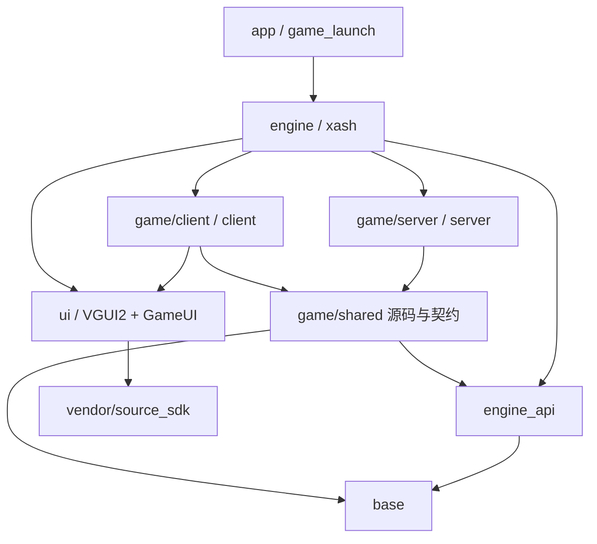

# 源码开发视图与迁入规则

本次迁移的旧树基线为 `d1f442a9`（完整 SHA 见 `source-path-map.json`）。这次改变文件归属、include 和构建路径，保留游戏行为、ABI、运行时资源标识和现有内容边界。

## 从开发任务找代码

```text
src/
├── app/                         macOS 入口、应用打包
├── engine_api/
│   ├── protocol/                usercmd、entity_state、事件、delta 描述
│   ├── interfaces/              引擎/游戏/UI 函数表
│   ├── types/                   ABI 类型、实体、模型、移动参数
│   └── formats/                 被公共模型类型引用的 BSP 格式
├── engine/
│   ├── runtime/                 Host、命令、配置、内存、进程生命周期
│   ├── network/                 loopback、通道、消息编码
│   ├── server/                  服务端实体调度、物理与状态同步
│   ├── client/                  客户端收包、预测调度、屏幕与输入桥接
│   ├── physics/                 世界碰撞、移动追踪
│   ├── renderer/                OpenGL 场景、模型、纹理绘制
│   ├── audio/                   混音、音效、音频解码
│   ├── assets/                  文件系统、模型/图片加载、WAD 格式
│   ├── math/                    引擎内部数学实现
│   └── platform/                SDL、macOS、后端配置
├── game/
│   ├── server/
│   │   ├── match/modes/         五种模式、回合、胜负和规则
│   │   ├── players/             玩家、出生、经济、观察者状态
│   │   ├── combat/              伤害、武器服务端支撑、购买和预缓存
│   │   ├── entities/            地图实体、门、触发器、目标物
│   │   ├── ai/                  cs_bot、hostage、navigation
│   │   └── runtime/             游戏库入口、全局状态、服务端工具
│   ├── client/
│   │   ├── input/              键鼠输入与命令生成
│   │   ├── prediction/         本地武器预测、客户端实体适配
│   │   ├── view/               相机、视角、客户端骨骼模型
│   │   ├── effects/events/     武器事件、弹壳、烟雾、特效
│   │   ├── hud/                血量、雷达、记分板、消息
│   │   ├── menus/              选队、选角、购买、局内面板
│   │   └── runtime/            客户端入口、消息读取、实体回调
│   └── shared/
│       ├── movement/           PM 移动算法，在两端分别编译
│       ├── weapons/templates/  武器实现及组合模板，在两端分别编译
│       ├── data/               人物名单、模式常量、伤害常量/数据
│       ├── interfaces/         游戏库契约、引擎调用适配声明
│       ├── entities/           双端实体声明及其模板
│       ├── players/            双端玩家声明、属性和消息契约
│       ├── strings/            游戏字符串工具及声明
│       ├── math/               双端游戏向量工具
│       ├── time/               游戏时钟与 duration
│       └── types/              带 cl/sv 命名空间的模板工具
├── ui/
│   ├── gameui/                 主菜单、建房、设置、控制台窗口
│   └── vgui2/                  控件、字体、面板实现、引擎桥接
└── base/                       通用容器、JSON、元编程、平台兼容
vendor/
├── CMakeLists.txt              系统 SDL2、FreeType 依赖接入
└── source_sdk/                 VGUI2 所需第三方 SDK 子集
```

`engine/server` 负责“让服务器运行”，`game/server` 负责“服务器怎样裁定这局游戏”；`engine/client` 负责引擎客户端，`game/client` 负责玩家看到的游戏表现。主菜单/设置位于 `ui/gameui`，局内购买/选角位于 `game/client/menus`。

## common、dlls、pm_shared 的区别怎样落实到目录

| 原目录 | 原来实际承担的职责 | 现在的落位 |
| --- | --- | --- |
| `common/` | 公共类型/接口，混有格式和平台配置 | `engine_api`、`base`、`engine/assets`、`engine/platform/config` 分别接收 |
| `dlls/` | 服务端玩法，混有双端武器实现和声明 | 服务端实现进 `game/server`；双端实现/声明进 `game/shared` |
| `pm_shared/` | Player Movement 算法与移动 ABI 类型 | 算法进 `game/shared/movement`；`pm_defs`/`pm_movevars`/`pm_info` 进 `engine_api/types` |
| `game_shared/bot/` | 当前仅由服务端编译的导航和 BOT 基础实现 | `game/server/ai/navigation` |
| `public/` | 通用工具、双端游戏工具、接口混放 | 通用部分进 `base`，游戏部分进 `game/shared`，ABI 进 `engine_api` |
| `cl_dll/` | 客户端表现、输入、预测和局内面板 | `game/client` 下按职责细分 |
| `engine/common/` | 引擎运行时、网络、资源、音频、物理混放 | `engine` 下按职责细分 |
| `vgui2_support/GameUI/` | 菜单和设置 | `ui/gameui` |
| `SourceSDK/` | 第三方实现 | `vendor/source_sdk` |

没有保留旧目录的软链接、转发头文件或全局 include 搜索桶。源码跨目录引用例如 `#include "game/shared/weapons/weapons.h"`，直接能看出所属层。运行时的 `cl_dlls`、`dlls` 资源目录名、函数/库名和 ABI 槽位不属于源码目录迁移范围。

## 构建和依赖边界



图表示主要构建关系，不声称现有 C++ 类已经完全解耦。CMake 逻辑目标名称保持不变；源码入口改为 `src/app`，应用输出仍为 `build-cso-ui/game_launch/CSMoE.app`，运行脚本不需要更改应用位置。

`src/game/shared/sources.cmake` 是两端共用的唯一源码清单。共享移动、52 个武器 CPP、人物名单实现和 Unicode 实现必须在客户端与服务端各编译一次，保持原来的编译宏和命名空间。目录里“共享”表示源码或契约共享，不表示两端共用一个对象实例。仅用于服务端的字符串实现仍在 `game/server/runtime`，双端都 include 的声明在 `game/shared/strings`。

### 尚未解耦的历史边界

- `game/shared/entities`、`players` 包含预测需要的旧实体/玩家类声明；一些声明中仍有仅服务端有意义的成员。后续可拆接口，但本次不改布局和类型。
- 若干共享武器在 `#ifndef CLIENT_DLL` 内调用 `game/server/match/modes/mods.h`；客户端实体工厂在 `#ifdef CLIENT_DLL` 内接入 `game/client/prediction/bte_weapons_register.h`。这是同一源文件两次编译的现有适配点，不能据目录名误删。
- `engine/physics/world.h` 仍引用共享移动入口声明；以后可拆专门的移动接口。本次保留原调用关系。
- SDK 的 `OfflineMode.h` 有两条指向 VGUI 接口/控件的历史引用；该头文件不等于一个独立可部署 SDK。第三方来源和原许可证继续保留。
- SDK 的四个 tier0 POSIX 源文件仍通过旧 PUBLIC source 规则传播；`controls.cpp` 仍由两个 UI 目标编译。这次没有顺带改变它们的链接方式。

上述越层 include 逐项列在 `source-boundary-exceptions.json`，每条包含路径和原因。`tools/check-source-layout.py` 阻止新增未记录的越层引用，并检查旧目录回流、映射失效及共享代码双端编译。静态 include 检查不能证明所有链接和运行时依赖均已解耦。

## 从完整分支迁入

全局要求在根 `AGENTS.md`；每个功能的实际记录放入 `feature-imports.md`。不要把长期规则只记在本机 `.mydocs`。

1. 固定来源 remote/branch 和完整 SHA，明确迁入功能及验收行为。
2. 在 `source-path-map.json` 中查旧文件。没有映射的新文件按上面的职责落位，不恢复旧目录。
3. 按功能搬运源码变化，并分别核对构建、协议、客户端表现、资源和 UI。武器/人物/模式不能只搬一份 CPP。
4. 维护共享源码清单、include 边界及必要的资源清单；新增例外需写明具体原因，不能扩大整层白名单。
5. 运行对应检查，记录通过、已知告警和未验证项；每个功能独立 commit。

查询例子：

```sh
python3 - <<'PY'
import json
m = json.load(open('docs/source-path-map.json'))['paths']
for old in ('common/entity_state.h', 'dlls/player.cpp',
            'dlls/wpn_shared/wpn_ak47.cpp', 'pm_shared/pm_shared.cpp'):
    print(old, '->', m[old])
PY
```

映射是历史定位表。后续正常删除文件时，在功能记录中说明删除并移除相应映射；再次迁移时更新目标路径。原始映射由 Git 历史保留，不能为了让检查通过而创建空壳旧文件。

## 本轮验证记录（2026-09-08）

| 检查 | 结果 |
| --- | --- |
| 迁移完整性 | 1,536 个旧文件均有实际存在的新路径；根目录不保留旧源码目录/别名 |
| C/C++ 行为差异 | 与 `d1f442a9` 比较，除 include 行外文本一致；没有修改函数体、消息或资源字符串 |
| 编译图 | 迁移前后均 732 次编译、654 个实现文件；宏、语言、优化选项保持，Git 构建版本戳正常变化 |
| 共享实现 | 57 个 CPP 各有一次 CLIENT_DLL、一次 SERVER_DLL 编译；52 个武器、3 个移动、人物和 Unicode 各 1 个 |
| 源码规模 | C 系列仍为 1,499 个文件、395,855 行有效代码；本次是职责重组 |
| 目录守卫 | 正向检查通过；注入旧根目录、客户端引用服务端、缺失一侧编译后，分别正确失败 |
| HUD / 购买 | 11 TextMsg、4 TeamScore、24 Brass 及异常包诊断；44 购买项/路由/5 组配装；44/44 购买图通过 |
| 资源 | 原有 468/472 路径可用；两条声音缺失和两个原生事件名称保持基线，不新增告警 |
| 本地运行 | BOT 冒烟、购买/开火；五模式分别验证本地玩家 + 3 BOT、普通回合、DM/TDM 重生、生化感染 |
| VGUI 交互 | 实际控件事件覆盖五模式下拉、选择/取消、中文名字输入/应用、退役设置缺席 |
| 测试工具 | 修复 PTY 分块解码中文；37 个 UTF-8/ANSI 分块位置验证通过。异步 UI 命令需等 `mouse_release` / `type_complete` 后检查结果 |

系统原生键鼠自动化、每张地图/每把武器的全部行为及跨机器分发不属于上述通过项；应用仍使用本机 SDL2/FreeType 和 Steam 基础素材。运行资源没有随源码目录搬迁。
